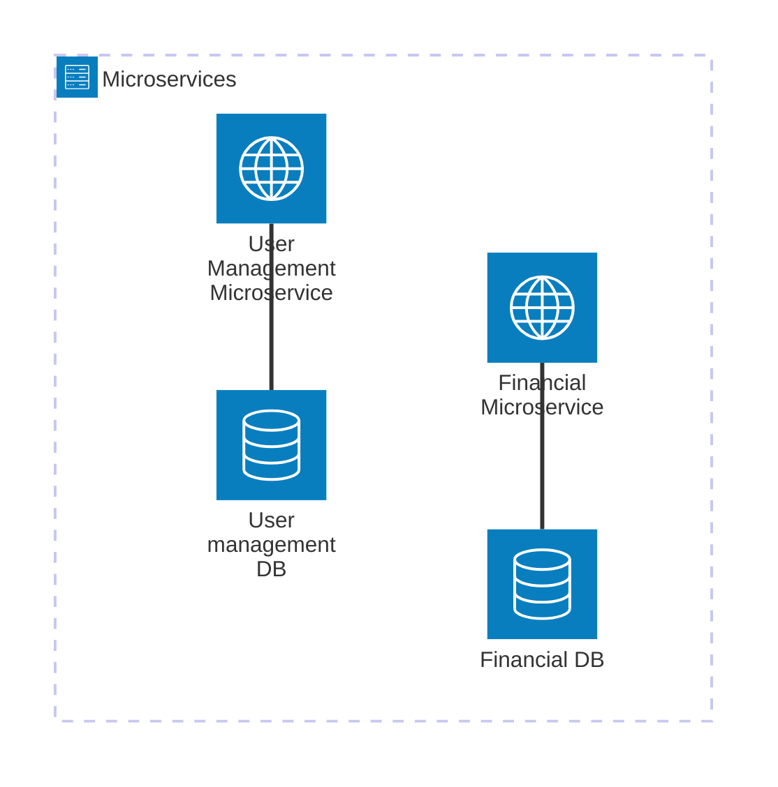

## Table of Contents


- [SelfResearch challenge overview](#selfresearch-challenge-overview)
- [Requirement understanding](#requirement-understanding)
- [Proposed solution](#proposed-solution)
- [Technical overview](#technical-overview)
  - [Technologies](#technologies)
- [Run and test application](#run-and-test-application)
  - [Web API](#web-api)
  - [Web site](#web-site)
  - [Setup local environment](#setup-local-environment)
    - [Explanation](#explanation)
- [API Documentation](#api-documentation)
- [Testing](#testing)
  - [Code coverage report](#code-coverage-report)
    - [Overview](#overview)
    - [Dependency](#dependency)
    - [Generate report](#generate-report)

# SelfResearch challenge overview

The propose of this repository is to apply some key concept in the software engineering industry


## Requirement understanding

Initially, I am going to create a new digital wallet platform where the users can register some payments to increase their balances, transfer it to another user.
Also, user and wallet states will be handled in order to create some business validations. 

## Proposed solution

The system will, initially, have two microservices and one frontend to tackle the requirements. The system will be able to store users, their financial transactions, list them and handle the wallet's balance.

Next steps:
- Add security layer for the operations
- Register users by external identity providers such as Google or any others.
- Live balance updates using websockets

## Technical overview 

Each microservice will communicate with the other in an event based architecture. Also, the microservices will follow DDD approach, RESTFull standard and handle data persistence between different microservices. 
The client web site is going to consume both microservices to show the required data and for creating the needed ones. 

### Architecture diagrams

There you can find the system's high level diagrams




### Technologies

The following is the tech slack for solving the challenge


| Tech      | Version |
| --        | --      |
| NET       | 9       |
| Angular   | 19      |
| Postgres  | 17.trixie|
| EF        | 9.0.9   |
|Azure Service Bus |  |


### Project architecture

The project code is organized in the following way:
TBD


### External dependencies
There are some external nuget packaged that were included to achieve the project objetives:

- [FluentResults](https://www.nuget.org/packages/FluentResults)
- [NServiceBus](https://www.nuget.org/packages/NServiceBus)

### Microservices overview

#### User management

This microservice will be incharged of handling user related data such as state, profile and personal information.


#### Financial

This microservice will take care about the financial transactions and the user balances.

#### Microservice interaction

The microservices will communicate between them using an event driven architecture supported by Azure Service Bus messaging queue provider.

##### List of topics

| Message   | Microservice | Meaning | Listeners
| --        | --           | --      | -- |
| selfresearch.usermanagement.api.contracts.usercreationsucceedmessage | UserManagement | A new User was created in the system | Financial Service|
| selfresearch.financial.api.contracts.walletcreationsucceedmessage | Financial | A new wallet was created | UserManagement | 

##### Data consistency strategy

To ensure data consistency across the services, the saga pattern is implemented using Orchestration-based of choreography-based approachs dependeing on the needs.

There you have some useful documentation from [Chris Richardson](https://github.com/cer) about the topics:

Elemental -> https://microservices.io/patterns/data/saga.html
Extended explanation -> https://livebook.manning.com/book/microservices-patterns/chapter-4#62


## Run and test application

### Web APIs

For debugging API you could use Scalar adapter to test each functionality. Run manually `SelfResearch.UserManagement.API` project and browse this URL http://localhost:5262/scalar/.
**Note:** You will need to create some secrets to run the application locally. You will need to have the following keys:

``` text
ConnectionStrings__DefaultConnection -> The user management db connection string
Azure__ServiceBus__ServiceBusConnectionString -> The serviceBus connection string
Azure__ServiceBus__NServiceBusEndpointName -> The NserviceBus endpoint name
```

Note: You also could run the application after deploying it on Docker. See the following section for further details.


### Web site
You could debug and run locally the web site doing the following:

1) Go to `./src/SelfResearch.DigitalWallet.Web/` directory

2) Run `npm i`

3) Run `npm run start`

4) Browse http://localhost:4200


Note 1: The web site has backend URL set to web api container. So, it is good idea to setup the environment before start using it. 
Note 2: You also could run the application after deploying it on Docker. See the following section for further details.


### Setup local environment


To run the application locally you might choose to mount Docker containers. At the moment, we have four different containers:
- Postgres -> Hosting DBs.
- UserManagementAPI_Container -> Hosting the user management web api.
- FinancialAPI_Container -> Hosting Financial web api.
- DigitalWalletWeb_Container -> Hosting the Angular Web.
- nginx -> TBD

There is a bash script which creates and run the containers. Mentioned script has the capability to build and deploy on Debug/Release and Development/Production configurations. Also, this script needs a .env file to be placed at project directory level in order to solve the environment variables for the keys. 
i.e: For UserManagement web api you must have a `.env` file in the same directory as `Selfresearch.UserManagement.API.csproj` with the following keys:

```bash

ConnectionStrings__DefaultConnection='Host=yourhost;Port=5432;Database=dbName;UserName=theUser;password=thePassword'
Azure__ServiceBus__ServiceBusConnectionString='Endpoint=sb://theEndPoint/;SharedAccessKeyName=TheSharedAccessKeyName;SharedAccessKey=TheKey'
Azure__ServiceBus__NServiceBusEndpointName='NServiceBusEndpointName'

```
The same must applied to Financial web api.

**Note** that the default configuration is Debug/Development.

There you have the step by step to setup the env from scratch:

1) Go to repository root directory (same location as `setup_local_env.sh`). 

2) Add execution mode for `setup_local_env.sh` file:
`chmod +x setup_local_env.sh`

3) Execute `setup_local_env.sh`
`./setup_local_env.sh`

4) Validate everything is good browsing the following URLs:
- User management Web API: http://localhost:5266/scalar/
- Financial Web API: http://localhost:5255/scalar/
- Web site: http://localhost:4222/

If you wish to run the local env like production one, just execute the following command (only for Web API at the moment):

`./setup_local_env.sh Release Production`

Take into consideration that Scalar is not available for production configuration.

#### Explanation

Several files are involved on the environment setup. You can see each file responsability below:

`docker-compose.yml` --> To create the containers. There we have the WebAPI, DB, Web site container specifications.

`docker-compose.override.yml` --> To inject some configurations such as environment variables.

`Dockerfile.UserManagement.api` --> To build and run User Management web api. In the same way, the database is deployed and populated throught data migrations during this process.

`Dockerfile.Financial.api` --> To build and run Financial web api. In the same way, the database is deployed and populated throught data migrations during this process.

`Dockerfile.DigitalWallet.web` --> To build and run web site.

`.env` --> There we have the default environment configuration.

`setup_local_env.sh` --> Bash script to orchestrate and do the magic.

`nginx.conf` --> routing configuration for nginx web server (TBD).

## API Documentation

You can ask the api contracts browsing those URL:

For the User management api:
http://localhost:5266/openapi/v1.json

For the Financial api:
http://localhost:5255/openapi/v1.json


---

## Testing


### Code coverage report

#### Overview
 
For ensuring code quality, code coverage metric was added. To follow the industry trend, `coverlet.colector` is choosen the package to perform this task.

Disclaimer: Migrations, Program.cs and AppDbContext are excluded from code coverage report. 

#### Dependency

The following tool dependency must be installed:
`dotnet tool install -g dotnet-reportgenerator-globaltool`

#### Generate report
For running the coverage report we have a ready to go script named `coverage_report.sh` who creates the desired report. Its implementation takes into account `coverlet.runsettings` configuration file where we can find output directory, format, the excluded files such as DB Migrations and so.

To run it we must:
1) From repository root directory, go to Test project folder:

`cd src/SelfResearch.UserManagement.API.Test/`
or:
`cd src/SelfResearch.Financial.API.Test/`

2) Provide execution mode to the bash file:

`chmod +x coverage_report.sh`

3) Run the script:

`./coverage_report.sh`

4) Once it is finished, you can find a TestResults folder which contains a coverage-report folder. Browser inside an open the index.html file in any web browser.


Note: Each time you run the script, the old reports will be deleted!!!
